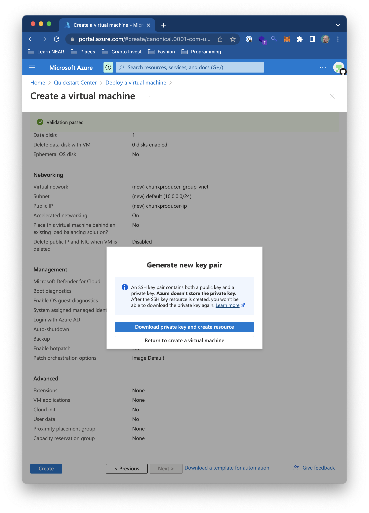
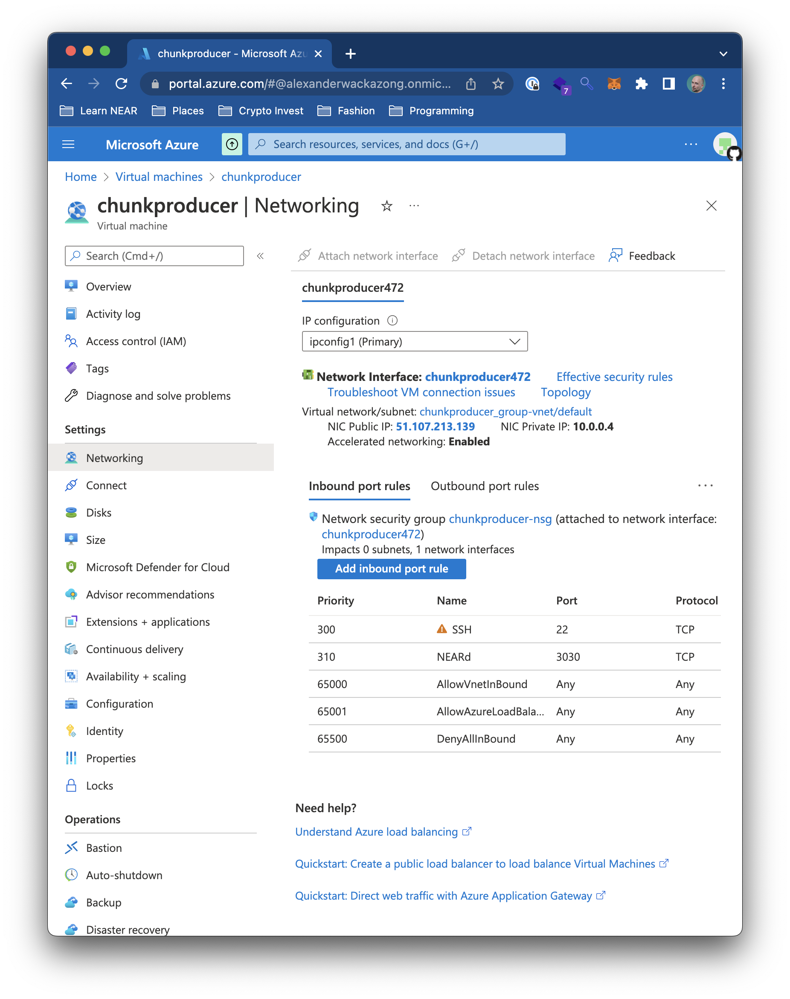

# NEAR Protocol Validator Node Setup for Microsoft Azure

NEAR Stakewars Episode III challenge 05 contribution

This article is a step-by-step guide on how to create a validator node for NEAR protocol, based on the challenges 01-04 of the [NEAR Stakewars Episode 3](https://github.com/near/stakewars-iii/). The network used is shardnet.

There are two environments that are used in this guide:

1. The actual server where the validator node is running ("node")
2. The machine used to control and manage the node ("manager")

The virtual machine the node is running on is created on Microsoft Azure.

## Create wallet

Using a web browser on the manager, create a new account on the network with a unique id and seed phrase.

### Select a new account id


### Choose secret key as security method


### Secure your account with a passphrase


### Verify your passphrase


### Assert that your wallet has been created


## Install NEAR command line utility

On the command line on the manager, install the NEAR command line utilities to retrieve information from the network and make calls to smart contracts.

### Install near-cli


## Executing near-cli commands

### Get proposals for next epoch


### Get current validators


### Get validators for next epoch


## Create a virtual server on Microsoft Azure

Using a Microsoft Azure account and subscription, create a virtual machine to host the node.

### Load the Azure Dashboard in a web browser


### Create a new Linux virtual machine


Set up the virtual machine with the settings displayed in the following screenshot.


### Create a new disk

For storing the digital ledger data, create a new disk to connect to the virtual machine.


Add the disk to the virtual machine setup.


### Adjust remaining virtual machine settings


### Review settings and create virtual machine


### 


### Download the key file used to connect to the virtual machine via ssh



### Wait until the virtual machine has been created


### Go to resource and identify IP of virtual machine


### Connect to virtual machine from manager


### Check if virtual server supports neard


### Install Rust


### Install required packages


### Mount the disk to hold the digital ledger data


### Clone the nearcore repository to get the near source code


### Initialize the working directory


### Open Firewall

For RPC calls, open port 3030 for the virtual machine




### Start the neard process

As soon as you start the node it will start downloading headers and blocks. If you stop here the node will act as a regular node, receiving RPC calls. Adding a validator key will turn it into a Validator Node.


## Add validator key to node

### Login to NEAR shardnet on manager

Since near-cli is only installed on the manager for security reasons, you need to create the `validator_key.json` file on the manager and then copy it securely to the node. 


### Create validator key file


Create the file as per the screenshot above and then edit it:

- Edit `account_id` => xx.factory.shardnet.near, where xx is your account id name. The account id must match the staking pool contract name or you will not be able to sign blocks.
- Change `private_key` to `secret_key`

File content must be in the following pattern:

```
{
  "account_id": "xxx",
  "public_key": "yyy",
  "secret_key": "zzz"
}
```

### Run node as validator


The node will try to become a validator. The proposal still needs to be triggered by a `ping` call to the staking contract (see below).

### Create service

For your convenience, run `neard` as a `systemd` service. Create a service file and enable and activate the service.


### Check logs

Check the logs using `journalctl`.


## Deploy and activate staking contract 

Using near-cli on the manager, deploy a staking contract for your node. Stake some NEAR with it and then activate the Validator seat application process.

### Deploy staking contract


### Check that node is listed in the list of validators

You can always check the current state of your validator node in the explorer.


### Update reward fee if needed


### Stake NEAR with the contract


### View staked balance


### Call ping method to start proposing as validator


To become a validator, your node must meet the following criteria

* The node must be fully synced
* The `validator_key.json` file must be in place
* The contract must be initialized with the `public_key` in `validator_key.json`
* `account_id` in the `validator_key.json` file must be set to the staking pool contract id
* There must be enough delegations to meet the minimum seat price.
* A proposal must be submitted by pinging the contract
* Once a proposal is accepted a validator must wait 2-3 epoch to enter the validator set
* Once in the validator set the validator must produce great than 90% of assigned blocks

## Monitoring and checking node status

### Check node version


### Check produced blocks and chunks


### View delegation info


### View reason for node being kicked out of the validator set


### Show number of produced and expected chunks


